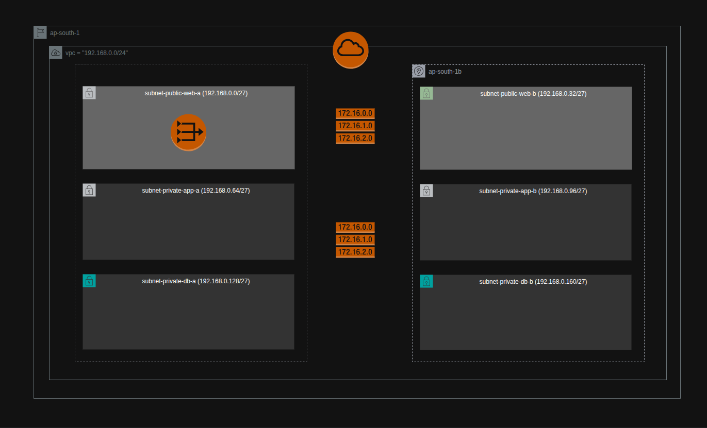

# Terraform + AWS

## Day 2: Creating VPC and Networking Components(subnets, route tables etc) for a 3-Tier Architecture

This project focuses on building the **networking foundation** required for a production-style **3-tier architecture** in AWS using **Terraform**.

The goal of Day 2 is to design and provision a **custom VPC** along with its core components such as **public and private subnets, Internet Gateway, NAT Gateway, and Route Tables**, following clean architecture and consistent naming conventions.

> ⚠️ **Cost Notice**  
> NAT Gateway is a **paid AWS service** and incurs **hourly charges plus data processing costs**.  
> This setup uses NAT for learning and production realism; always review AWS pricing before deployment.

---

## Architecture Overview

The infrastructure created in this project supports a classic **3-tier architecture**:

- **Web Tier (Public Subnets)**
- **Application Tier (Private Subnets)**
- **Database Tier (Private Subnets)**

The design spans **two Availability Zones** to ensure high availability.

---

## Architecture Diagram



## 📐 CIDR Planning

The VPC uses a `/24` CIDR block, which is subdivided into `/27` subnets for each tier and AZ.

```bash
| Tier | AZ | Subnet Type | CIDR Block |
|----|----|----|----|
| Web | ap-south-1a | Public | 192.168.0.0/27 |
| Web | ap-south-1b | Public | 192.168.0.32/27 |
| App | ap-south-1a | Private | 192.168.0.64/27 |
| App | ap-south-1b | Private | 192.168.0.96/27 |
| DB | ap-south-1a | Private | 192.168.0.128/27 |
| DB | ap-south-1b | Private | 192.168.0.160/27 |
```

---

This is a **beginner-friendly Terraform project** intended for learning and practice.

---

## 📁 Project Structure
```
.
├── main.tf
├── providers.sh
└── README.md
```
---

## 🧱 Resources Created

### 1. VPC
- Custom VPC with a private CIDR range

### 2. Subnets
- **2 Public subnets** for the Web tier
- **2 Private subnets** for the Application tier
- **2 Private subnets** for the Database tier
- Subnets are evenly distributed across two AZs

### 3. Internet Gateway (IGW)
- Attached to the VPC
- Enables internet access for public subnets

### 4. NAT Gateway
- Deployed in a public subnet
- Allows private subnets to access the internet securely
- Uses an Elastic IP

> ⚠️ **Note:**  
> A single NAT Gateway is used to reduce cost.  
> In a production-grade HA setup, **one NAT Gateway per AZ** is recommended.

### 5. Route Tables
- **Public Route Table**
  - Routes `0.0.0.0/0` to the Internet Gateway
- **Private Route Table**
  - Routes `0.0.0.0/0` to the NAT Gateway

### 6. Route Table Associations
- Public route table associated with Web subnets
- Private route table associated with App and DB subnets

## 📛 Naming Convention

To avoid inconsistency and overthinking, a **fixed naming formula** is used throughout the codebase:
```bash
<resource><access><tier>_<az>
```

### Examples:
- `subnet_public_web_a`
- `subnet_private_app_b`
- `subnet_private_db_a`

### Exceptions:
For **global or single-instance resources**, names are based purely on purpose:
- `vpc_main`
- `igw_main`
- `rt_public`
- `nat_eip`

## 🎯 Why This Design?

- Clear separation of concerns between tiers
- Private tiers are fully isolated from direct internet access
- Scalable foundation for ALB, ASG, and RDS in later stages
- Clean and readable Terraform code suitable for real-world projects

## 🚀 What’s Next (Day 3)

In the next phase, we will build on this networking layer by introducing:
- Security Groups
- Application Load Balancer (ALB)
- Auto Scaling Groups (ASG)
---

## 🔑 Prerequisites

Before running this project, ensure you have:

- An AWS account
- AWS CLI installed
- Terraform installed

## 🚀 Terraform Execution Steps

### Step 1: Initialize Terraform
```bash
terraform init
```
### Step 2: Format the Code
```bash
terraform fmt
```
### Step 3: Validate Configuration
```bash
terraform validate
```
### Step 4: Review Execution Plan
```bash
terraform plan
```
### Step 5: Apply Configuration
```bash
terraform apply
```
Type yes when prompted.

## 🌐 Verify Deployment

- Confirm the VPC, subnets, IGW, NAT Gateway, and route tables are created successfully in the AWS Console.
- Verify public subnets have a route to the Internet Gateway and private subnets route traffic via the NAT Gateway.
- Launch a test EC2 instance in public and private subnets to validate internet connectivity behavior.

## 🧹 Cleanup (Important)

To avoid AWS charges:
```bash
terraform destroy
```

## ❓ NAT Gateway & Route Table – FAQs

**Q: Why is one NAT Gateway created per Availability Zone?**  
A: To ensure high availability and avoid cross-AZ traffic if an AZ becomes unavailable.

**Q: Why should private subnets use a NAT Gateway in the same AZ?**  
A: This keeps traffic AZ-local, reduces latency, and prevents inter-AZ data transfer costs.

**Q: Does this require separate route tables?**  
A: Yes, each AZ uses its own private route table pointing to the NAT Gateway in that AZ.

**Q: Is this approach recommended for production environments?**  
A: Yes, this aligns with AWS best practices for resilient and scalable architectures.


## 📌 Notes

- This setup uses a single NAT Gateway to optimize cost; production environments should use one NAT Gateway per AZ.
- CIDR blocks are intentionally kept small and non-overlapping for clarity and easy scalability.
- Variables and modules are intentionally avoided at this stage to focus on core networking concepts.

## 📚 Learning Outcome

- Gained hands-on experience designing a multi-AZ VPC for a 3-tier architecture.
- Understood subnetting, route tables, and controlled internet access using IGW and NAT Gateway.
- Learned how to structure Terraform code with clear naming conventions and logical resource grouping.

## 🔮 Future Scope

- Refactor the configuration using variables, locals, and Terraform modules.
- Introduce Security Groups, ALB, Auto Scaling Groups, and RDS in subsequent stages.
- Enhance the setup with environment separation (dev/stage/prod) and remote state management.


## 🚫 Files Not to be Committed to GitHub

The following files and directories are intentionally excluded using `.gitignore`:

- **`terraform.tfstate`**
- **`terraform.tfstate.backup`**
- **`.terraform/` directory**

### ❓ Why are these excluded?

- These files contain **sensitive infrastructure details** such as resource IDs, IP addresses, and metadata(security risk).
- They are **auto-generated by Terraform** during `terraform init` and `terraform apply`.
- Terraform can **recreate them locally**, so committing them is unnecessary and unsafe.


## ⭐ Author

**Shobhit Batra** <br>
**Learning Terraform & Cloud | DevOps Enthusiast**